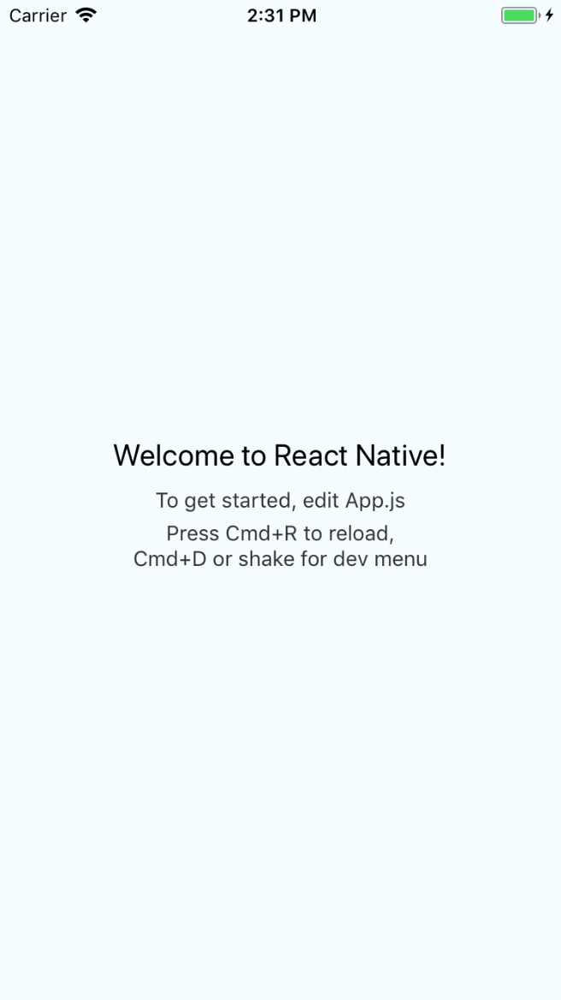

## 2. React Native

This is an overview of React Native.

### Quick Start - Not Recommended

Use the `create-react-native-app` project which uses `Expo`

```
npm i -g create-react-native-app
create-react-native-app my-project
cd my-project
npm start
```

This is a very fast way to create a `react-native` project but it's not without pitfalls.

1. Doesn't work well when you want to deploy to `App Store` (iOS).
2. Doesn't work well with 3rd party packages like `react-native-sound`, linking is problematic.
3. Sometimes `ejection` doesn't work.
4. Expo only packages don't `eject`.
5. Network bundling of JavaScript & Deployment problematic, WiFi & Ethernet.

Maybe things are better now (This Is JavaScript), but it was problematic 3 months ago and I've not re-visited.

### Quick Start - Recommended

If you want to work with hardware and deploy to a device, use this method. It's the only
reliable method I've found over the past 3 months.

```
npm install -g react-native-cli
react-native init AwesomeProject
cd AwesomeProject
react-native run-ios
```

Provided XCode is installed correctly, you should get the following screen in your simulator.

 

Footnotes:

* BLE (Bluetooth Low Energy) will not work with in the simulator.
* Compass will not work with in the simulator.
* Gyroscope and Accelerometer will CRASH your simulator.
* Camera have not tested in the simulator.
* Sound (React-Native-Sound) will work in simulator.

### React Native Component Overview

[https://facebook.github.io/react-native/docs/getting-started.html](https://facebook.github.io/react-native/docs/getting-started.html)

This link will give you an overview of RN components and APIs. There's a lot here. 

For example to show a few you can use:

```jsx
<View>
    <Text>This is some text.</Text>
</View>
```

### WebView - HTML5 Game Example

Create a game component.

```
import React from 'react';

export default class GameScreen extends React.Component {
    static navigationOptions = {
        title: "Game",
    };
    render() {
        const { navigate } = this.props.navigation;
        const gameHtml = require('./game/index.html')
        return (
            <WebView source={gameHtml} />
        );
    }
}
```

But to get this to work on your device you need to copy assets.

`./ios/AwesomeProject/assets/game`, then if they are loaded in `/assets` of the iOS project folder, they can be loaded via the `require`.

### 3rd Party Libraries

You will find that RN provides some core functionality but it's basic, and there's a lot of manual wiring for some components to be useful.

Here's an awesome resource:

[https://github.com/jondot/awesome-react-native](https://github.com/jondot/awesome-react-native)

### Deploying To Devices

Use this when you want to deploy to your device and test.

```objective-c
 // simulator
  jsCodeLocation = [[RCTBundleURLProvider sharedSettings] jsBundleURLForBundleRoot:@"index" fallbackResource:nil];
  
  // device
  jsCodeLocation = [[NSBundle mainBundle] URLForResource:@"main" withExtension:@"jsbundle"];
``` 

