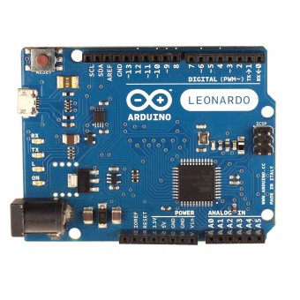
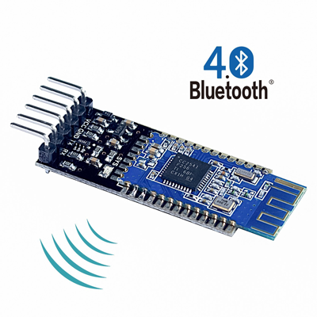
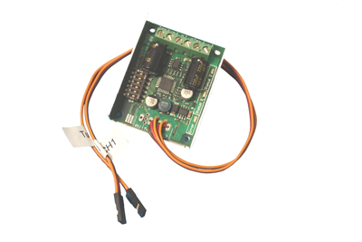
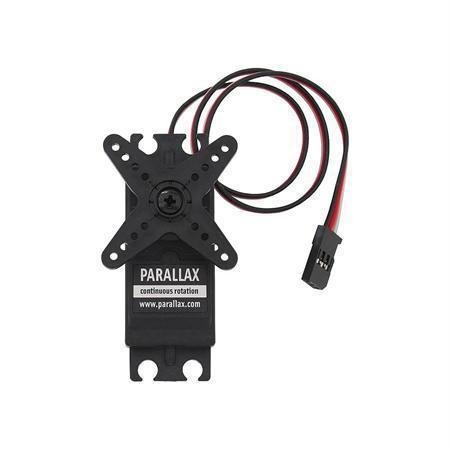
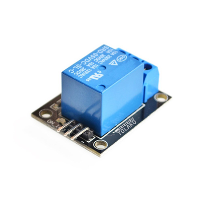
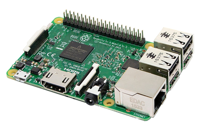
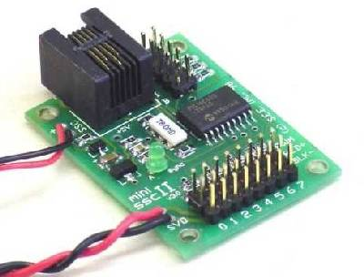
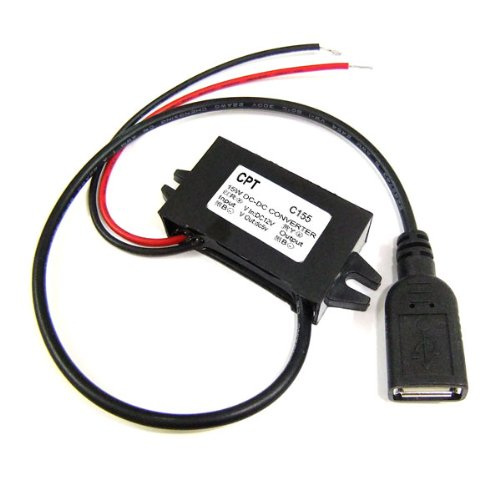
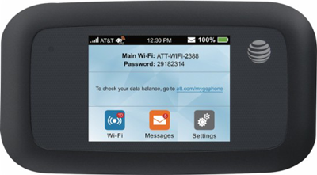

## 3. Robotics Overview ##

Here's an overview of the hardware I'll discuss today.

### iPhone 5 ###

### Genuine Arduino Leonardo ###

### HM10 BLE Module ###

### Sabertooth Motor Controller ###

### Servo Motors (Continuous Rotation) 

### DC Gear Motors

### 5V Relay Module

### Raspberry Pi 3

### Mini-SSC

### 12V-5V DC Convertor

### MiFi

